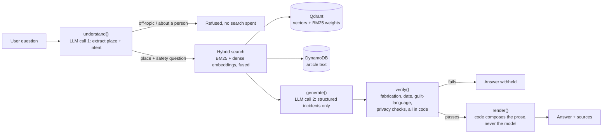
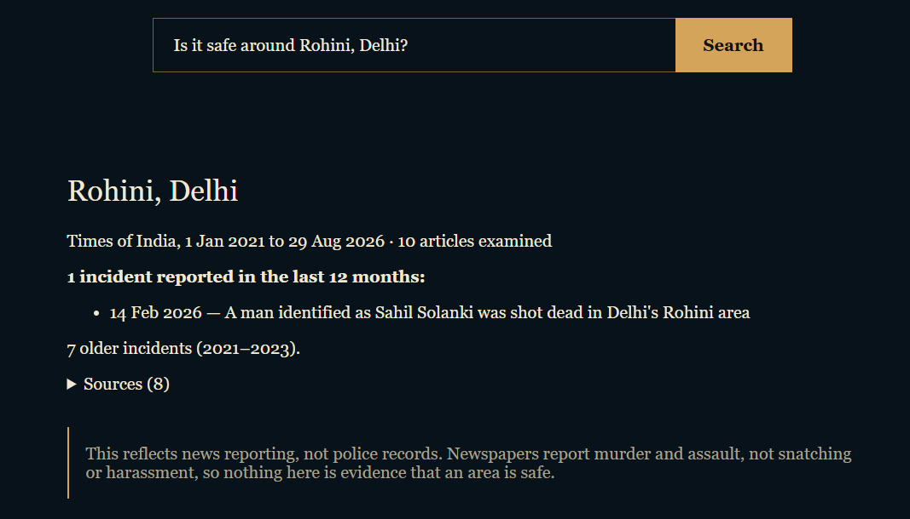

# Safe Route

**A small step in making India crime aware.**

**Live demo:** [saferoute.sandipshaw.online](https://saferoute.sandipshaw.online)

Safe Route answers one question: has anyone been murdered or seriously
assaulted near this place? It's a RAG system over Indian crime news (Times of
India, 2021–2026). It retrieves real articles and summarizes them, with
every claim linked back to its source.


It does not give you a safety score. That's on purpose.

Article counts measure newsworthiness, not danger. They reflect where a
newspaper has reporters, not where crime actually happens. A score built on
top of that would look scientific while being wrong. And most areas, most
months, have nothing reported at all. That's not the same as "safe," it's
usually just thin coverage. So the app shows you the evidence and stays out
of the verdict business.

---

## Architecture



The model never writes what a user reads. It returns structured JSON: a
claim, a date, a location, a legal status. Code checks it: fabricated
citations, invented dates, guilt asserted from a mere accusation,
contradictions between fields. Code writes the actual sentence a reader
sees. If a check fails, the answer gets withheld instead of shown.

Retrieval combines BM25 keyword search with dense embeddings
(`bge-small-en-v1.5`), fused with Reciprocal Rank Fusion. Neither works well
alone on Indian place names. BM25's tokenizer shreds names like
*Sakthikulangara* into meaningless pieces, and dense embeddings lose
precision on common ones. Measured on a held-out labeled set: BM25 alone hit
10% precision@10, dense alone 60%, fused together close to 100%.



Article text lives in DynamoDB, not in Qdrant. It didn't start that way. The
first version stored full article text as payload on every vector chunk, and
since most articles split into 3+ chunks, that meant the same text stored
several times over. The vector index grew to 2.3GB, four times over a
typical free vector-database tier, and that only surfaced when actually
sizing a deployment. Moving the text into DynamoDB, keyed once per article
instead of once per chunk, brought it back down by about a third.

---

## Guardrails

This corpus has a lot of sexual-offence victims, minors, and disputed
allegations in it. That's common, not an edge case. Four things are built
and tested against real articles pulled from the corpus, not made-up
examples:

**Allegation vs. guilt.** A check compares the model's claim text against its
own reported legal status. A second check looks for a named person directly
in front of a guilt verb ("X murdered Y") while the status is still
unproven. Caught a real case: the source said "accused," the model's first
draft claim said "murdered."

**Protected identities.** The prompt is told never to name a sexual-offence
victim, a minor, or a witness. Tested against a real article that names a
minor victim by name. The generated claim named no one. An adult victim of
some other crime can still be named, same as any normal news report.

**Prompt injection.** An early version matched one exact delimiter string.
Attacking it on purpose found it missed three trivial rewrites: different
casing, different spacing, no space at all. Fixed by matching the underlying
pattern instead of one literal string. All four variants now pass.

**Off-topic and abusive questions.** Refused before the second (expensive)
model call happens, using one classification field from the first call.
Tested against off-topic questions, a named-person question with no place,
and the harder case of a named person and a real place together.

None of these are complete. The guilt-language check can't catch the reverse
sentence order ("the murder of X by Y"). There's no code-level check yet that
catches a protected name slipping through if the model just ignores the
instruction. Both are known, not hidden.

---

## What was measured

**Retrieval precision**: a hand-labeled set of real search results (one test
area, Rohini, Delhi). 10% for BM25 alone, 60% for dense alone, ~100% fused.

**Generation recall**: a human-labeled answer key, scored across 6 runs, not
one. Mean 0.68, range 0.50–0.80. A single run of a free-tier LLM varies too
much to trust as a measurement.

**Qdrant's approximate search**: checked against an exact brute-force index
kept specifically for this comparison, not assumed correct because it's a
popular tool. 90% overlap on top-10 results.

## Limitations

- No entity resolution. A surname can match several unrelated people.
- One publisher. No cross-source corroboration is possible with this data.
- Publication date isn't incident date. The system resolves in-article date
  references where it can and says "not stated" when it can't. It doesn't
  guess.
- Severity-skewed on purpose. This corpus has murder and assault in it, not
  phone snatching or harassment, because that's what a major paper covers.
- No automated check that a citation actually supports its claim. That needs
  a human reader or a separate LLM-as-judge step, and isn't built yet.

A detailed internal log of decisions and mistakes exists from building this,
but it's not in this repo.

---

## Stack

```text
retrieval      BM25 (hand-written) + bge-small-en-v1.5, RRF fusion
vector store   Qdrant, self-hosted
article store  DynamoDB
generation     free-tier LLMs via OpenRouter, structured JSON only
backend        FastAPI, Python
deployment     Docker, AWS EC2, Cloudflare
```

No LangChain, no vector-DB abstraction layer, no ML framework beyond
`sentence-transformers`. Retrieval, chunking, and the tokenizer are
hand-written so every stage is something I actually understand, not
something a framework did for me.

---

## Running it locally

```bash
git clone <this-repo>
cd Safe_Route_Rag
```

`.env`:
```text
OPENROUTER_API_KEY=<your key>
AWS_ACCESS_KEY_ID=<your key>
AWS_SECRET_ACCESS_KEY=<your secret>
AWS_DEFAULT_REGION=<your region>
```

```bash
docker compose up --build -d
```

Open `http://localhost` (or `:8000`, depending on your port mapping).

Needs a populated Qdrant collection and DynamoDB table to actually return
anything. The corpus and pre-built vectors aren't in this repo.
